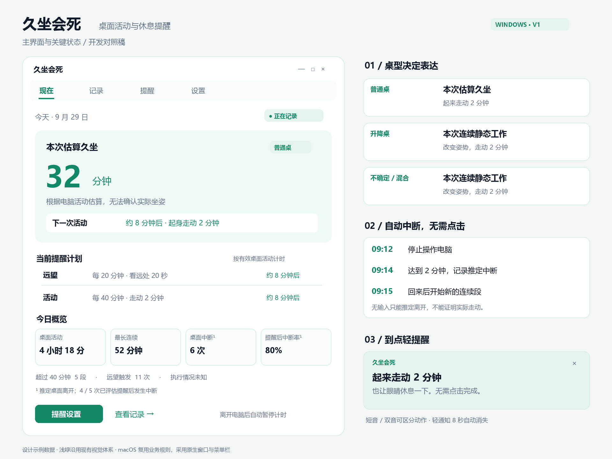
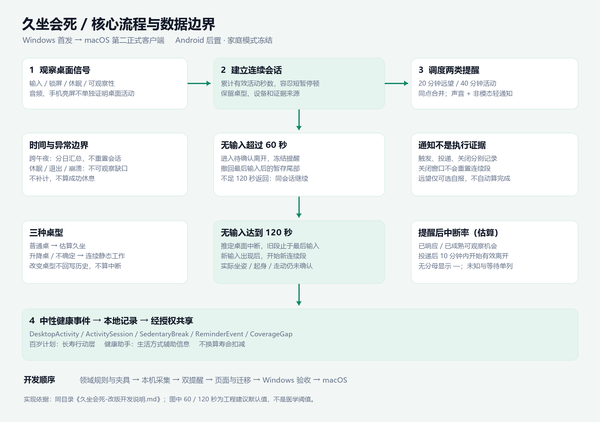

# 久坐会死 · 桌面活动管理改版开发说明

版本：1.0 · 2026-09-29 · 交付对象：Kimi Code

本文件是本次新定位的实施依据。它覆盖旧“个人护眼＋家庭护眼”路线中冲突的产品要求，但不是已经完成的功能说明。本次仅交付设计与开发文档，不修改应用代码、不提交或推送 Git。

## 1. 已确认的产品决策

产品名为 **久坐会死**，副标题为 **桌面活动与休息提醒**。帮助用户减少长时间连续桌面工作，通过自动记录、低打扰提醒和长期行为趋势形成闭环。名字可以醒目，数据和日常文案必须克制。

- Windows 为首发改版平台；macOS 为第二个正式、可独立运行的客户端，本轮即预留跨平台规则。
- Android 后置为可选配套端，不是首发依赖；手机亮屏时间不得并入桌面活动或延长桌面连续会话。
- 家庭模式冻结，从新版导航、付费权益和开发主线移除。已有代码和数据保留，不执行破坏性清理。
- 新用户选择普通桌、升降桌、不确定／混合使用；之后可随时修改。
- 默认每 20 分钟远望 20 秒、每 40 分钟活动 2 分钟。两类间隔和建议动作时长分别可配置。
- 声音、自动消失的轻通知、可选弹窗均支持。默认声音＋轻通知，无需点击完成。
- 本地独立运行，无需手机、账号或联网即可获得核心价值。
- 数据使用 DesktopActivity、SedentaryBreak 等中性事件；未来接入百岁计划与健康助手。不计算“少活多少分钟”、寿命扣减或医学风险分数。

商业边界：本轮不实现支付或订阅。基础计时、桌型选择、自定义提醒、自动中断和当天统计保持完整；长期报告、多电脑同步可作为后续商业化候选。此前讨论的价格不是本次定价结论。

## 2. 核查基线与实际差距

### 2.1 仓库状态

核查目录：`C:\Users\zhouh\Documents\Codex\2026-06-26\new-chat`。

| 项目 | 本次观察 |
|---|---|
| 本地分支 | `codex-wifi-sync-foundation` |
| 本地 HEAD | `1e405635fec7c09116f95a7a026f84d5df6ea858`，修正双端连续提醒同弹语义 |
| 初始工作区 | `git status --short --branch` 无未提交文件 |
| GitHub 同名分支 | 在线解析到同一 SHA，与本地 HEAD 一致 |
| GitHub 默认分支 | `master`，`c50d0113802c555af0495c592bb3a9e099bf345b` |
| 本地 master 到当前 HEAD | 本地引用比较为 33 个提交；不要据此把默认分支当成最新开发基线 |
| 技术栈 | Windows .NET 8 / WinForms；共享 Core；Android 原生 Java 和脚本构建 |

证据：[开发基线提交](https://github.com/zhouhjfz42-cell/EyeTimeTracker/commit/1e405635fec7c09116f95a7a026f84d5df6ea858)、[默认分支提交](https://github.com/zhouhjfz42-cell/EyeTimeTracker/commit/c50d0113802c555af0495c592bb3a9e099bf345b)。远程分支可能继续变化，开发前重新核对。此次是源码和文档审查，未运行应用或声称原有构建、运行测试已通过。

### 2.2 已有实现与改版影响

| 现有文件／实现 | 核查结果 | 改版要求 |
|---|---|---|
| `src/EyeTimeTracker.Core/Models/TrackerSettings.cs` | 闲置阈值 180 秒，CountAudio=true，累计提醒默认 5.5 小时，连续提醒默认 20 分钟 | 新建桌面策略，不能照搬这些默认值 |
| `Core/Tracking/EyeTimeAccumulator.cs` | 最近输入或音频可累计，跨日结束当前段 | 音频不得单独证明人在电脑前；跨日保留逻辑会话 |
| `App/Tracking/TrackingController.cs` | 10 秒采样；连续提醒使用跨端起点和墙上时间差 | 改用有效桌面活动秒数及本机策略；增加单调时钟和事件去重 |
| `App/Platform/NotificationService.cs` | 声音＋`PcReminderDialog.ShowDialog()` | 默认非模态、不抢焦点；展示成功与规则触发分开记录 |
| `App/UI/MainForm.cs`、`MainFormLayout.cs` | 660×760 首页，今日总用眼以及昨日／周／月卡片 | 首屏改为当前连续段和下一次行动，历史汇总移至记录页 |
| `Core/Models/DailyRecord.cs` | 总秒数、小时分布、连续段及提醒状态 | 无法直接表达桌型、证据、中断关联与提醒投递结果 |
| `Core/Models/UsageSegment.cs` | 有设备、来源和起止时间 | 可复用区间思想，不把旧 ScreenUsage 改名成真实久坐 |
| `Core/Sync/UsageIntervalMerger.cs` | 已有精确区间合并旁路 | 核验后复用区间运算；不要默认它已替换全部旧 10 秒桶 |
| `Core/Reminders/ContinuousReminderBaseline.cs` | 旧跨端连续提醒基线；历史交接部分路径已过期 | 新桌面会话独立；以当前源码为准 |
| `App/UI/EyeCareRemindersForm.cs`、`StatsForm.cs` | 已有提醒配置和统计入口 | 复用外壳，重写信息结构与数据源 |
| `android/.../EyeTimeStore.java`、`MainActivity.java`、`FamilyHomeActivity.java` | 手机统计、跨端配置、家庭能力已有实现 | 冻结旧线；新版桌面不得被旧手机设置反向覆盖 |
| `docs/handoffs/CURRENT.md`、`docs/ROADMAP.md` | 仍包含家庭商业版和联合用眼旧路线 | 文档入口指向本说明；历史记录不删除 |

上表中 `Core/`、`App/` 分别是 `src/EyeTimeTracker.Core/`、`src/EyeTimeTracker.App/` 的缩写。

## 3. 保留、删除入口、新增

| 类别 | 内容 |
|---|---|
| 保留并调整 | 输入闲置检测、锁屏／休眠处理、本地存储、托盘、启动设置、国际化资源、趋势图容器、诊断、区间工具 |
| 从新版入口移除 | 今日总用眼主指标、按全天 6／8 小时染绿黄红、5.5 小时累计护眼提醒、应用使用排行榜、手机来源占比、家庭／儿童规则、走路看手机提醒 |
| 冻结而非物理删除 | Android 客户端、家庭数据、旧 WiFi 协议及旧统计。通过产品入口／功能开关隔离 |
| 新增 | 桌型引导、双提醒计划、桌面连续会话、中断事件、透明的估算说明、提醒状态与投递记录、中断率、事件导出和版本化迁移 |
| 后续 | macOS 原生桌面体验、长期趋势、多台电脑同步、经授权共享健康事件 |

不要顺手重命名所有项目、程序集、命名空间、包名、安装路径。P0 先改展示品牌和领域模型，保存旧应用身份以保障升级；安装包名和签名另列发布迁移任务。

## 4. 平台与整体信息架构

桌面主导航只保留 **现在、记录、提醒、设置**。托盘／Mac 菜单栏提供当前状态、打开主界面、暂停提醒 30 分钟／恢复、退出。关闭窗口继续后台运行，退出才结束采集。

Windows 使用既有 WinForms；Mac 采用适合 macOS 的原生窗口和菜单栏交互，具体框架在 P1 技术验证后确定。不要把 WinForms UI 作为可移植界面。共同资产是事件规范、纯业务算法规范、JSON 测试夹具与文案键。

建议分层：平台活动信号 → ActivityClassifier → SessionReducer → ReminderScheduler → NotificationAdapter；事件存储 → DailyAggregator → UI / HealthExportAdapter。

平台接口建议：`IActivitySignalProvider`、`IClock`、`INotificationAdapter`、`IEventStore`、`IStartupIntegration`。`IClock` 同时提供 UTC 和单调时间；业务状态转换不引用 WinForms、Windows DLL 或 Mac UI 类型。Mac 的输入闲置、锁屏、休眠、权限和声音投递需用目标系统真实验证，不在本说明中承诺未经验证的平台 API。

## 5. 活动识别和连续会话

### 5.1 先定义能观察到什么

系统能观察输入、锁屏、休眠等信号，不能确认用户姿势、起身、走动或远望。普通桌显示“估算久坐”；升降桌和不确定显示“连续静态工作”，详情同时说明“根据电脑活动估算，无法确认坐站姿势”。后台音乐不能单独维持桌面活动。

以下是本次建议的可实施默认值，不是医学标准：

| 参数 | 默认 | 含义 |
|---|---:|---|
| activitySamplingSeconds | 5 秒 | 活动采样目标；允许最大一个采样周期检测延迟 |
| idleGraceSeconds | 60 秒 | 短暂停顿容忍，超过后进入待确认离开 |
| qualifyingAwaySeconds | 120 秒 | 从最后输入起连续无输入达到此值，认定一次“推定桌面中断” |
| eyeIntervalSeconds / eyeSuggestedSeconds | 1200 / 20 | 远望提醒间隔／建议动作时长 |
| movementIntervalSeconds / movementSuggestedSeconds | 2400 / 120 | 活动提醒间隔／建议动作时长 |

动作时长与自动离开阈值是不同字段，修改“活动 3 分钟”不得悄悄改变“自动中断 2 分钟”的识别口径。识别参数放在高级设置并记录 policyVersion，首版可固定阈值，先不开放复杂调参。

### 5.2 采集状态机

| 当前状态 | 条件 | 下一状态与动作 |
|---|---|---|
| Unknown | 启动后尚无新活动信号 | 不补计关闭程序期间时间 |
| Unknown / Away | 收到输入且未锁屏休眠 | Active，新建会话，从新活动时刻计时 |
| Active | 无输入未超过 60 秒 | 容忍短停顿；尾部最多 60 秒为暂存估计，标记 provisional |
| Active | 无输入超过 60 秒 | IdleCandidate，冻结提醒，撤回最后输入后的暂存尾部；记录 gap 起点 |
| IdleCandidate | 120 秒前再次输入 | 保留同一 sessionId；已撤回的 gap 不计活动秒数；从新输入恢复 |
| IdleCandidate | 无输入达到 120 秒 | Away；结束旧会话于最后有效输入，生成一个 inferred SedentaryBreak |
| Active / IdleCandidate | 锁屏 | 立即暂停活动并开始 absence；持续 120 秒可生成推定中断；短锁屏返回仍为原会话，锁屏时间不累计 |
| 任意 | 系统休眠 | 立即结束可观察段；恢复后新建会话，休眠记 unavailable，不能自动冒充成功活动 |
| 任意 | 退出／崩溃／采样大缺口 | 记录 unknown gap；不补计、不算中断成功；重启新会话 |

事件结束时间与 detectedAt 分开存。达到 120 秒时已经能确认阈值，但离开结束时间要到新输入后才确定。一次离开只产生一个 breakId，后续更新同一事件。

实现补充：相邻真实输入之间的间隔不超过 60 秒时，把间隔提交为有效活动；超过 60 秒则该间隔不提交。输入后的尾部只暂存，待下个输入或闲置状态确认；因此 committed 是不可反向修改的有效区间。锁屏立即撤回尚未确认的尾部并暂停。

主数字可以显示暂存估计；稳定统计与导出只用已确认区间。提醒仅根据 committed activeSeconds 到期，最多有容忍窗口带来的延迟；不得在待确认离开状态弹提醒。UI 下一提醒注明“按有效桌面活动计时”，允许发现闲置后修正。实现和测试需固定这一取舍，不能一处按墙上时间、一处按输入秒数。

阅读长文、观看视频时可能无输入但人仍在桌前，这是估算限制。P0 不让音频覆盖闲置；设置页说明限制。后续可增加显式“阅读／演示模式”，其结束、有效期和证据必须独立，不能静默改判。默认不采集摄像头、不记录键盘内容、窗口标题或应用名称。

### 5.3 两个计时基准

- `sessionActiveSeconds`：当前未被有效离开中断的桌面会话内有效活动秒数。远望提醒、关闭通知、暂停提醒均不能清零它。
- `eyeCycleActiveSeconds`：距上一次远望提醒调度后新增的有效桌面活动秒数。每到间隔调度一次，调度不意味着完成远望。
- 活动到期点为当前会话活动秒数的 interval 整数倍；40、80、120 分钟分别是一条活动机会，不按每个采样重复触发。有效离开后两个计时重置。
- 23:59 到 00:00 不重置 sessionId 或提醒进度；仅将活动区间按当地日期切分归档。
- 桌型修改结束当前分类段并开始新段，不算身体中断；保留会话连续计时，历史按当时桌型显示。

## 6. 提醒状态机与冲突规则

提醒实例状态：`Due → Suppressed / Dispatching → Delivered / DeliveryFailed → Closed`。行为响应单独关联，不使用“弹窗关闭＝休息完成”。幂等键为 `deviceId + sessionId + reminderType + occurrenceIndex + policyVersion`，落盘后投递，崩溃恢复不重复播音。

| 场景 | 处理 |
|---|---|
| 20 分钟远望到期 | 播放短音；轻通知“看远处，放松 20 秒”；8 秒自动消失 |
| 40 分钟活动到期 | 普通桌“起来走动 2 分钟”；其他桌型“改变姿势，走动 2 分钟”；使用区别明显的双音 |
| 两类同一采样到期 | 合并为一次活动通知，补充“也让眼睛休息一下”；两条规则事件用相同 deliveryGroupId，远望标记 merged，不能算两次实际展示 |
| 只播声音 | 仍有触发及声音投递结果；没有通知展示计数 |
| 继续操作、不理会 | 保留连续段；不认定已中断；默认等下一个活动间隔，不每分钟追提醒 |
| 点关闭／自动消失 | 仅关闭展示；连续计时不重置 |
| 稍后提醒 5 分钟 | 可选次级操作；一次性重新投递原实例，分母不增；到期重查 Active 状态 |
| 暂停提醒 30 分钟／免打扰 | 继续采集；到期记录 suppressed；恢复不补发历史队列，从下一有效调度点继续 |
| 通知权限拒绝／声音不可用 | 保留触发，记录投递失败或不可确认；提醒页显示可操作状态，不报成功 |
| 锁屏／IdleCandidate／Away | 不投递；同次状态更新先处理活动变化，再评估提醒 |
| 修改提醒配置 | 新 policyVersion 从修改时刻开始算下一提醒间隔，不追补旧点；sessionActiveSeconds 不清零，固定 >40 分钟指标不变 |
| 非默认强提醒 | 后续可选，默认关闭；必须允许关闭，不强锁屏 |

投递成功仅表示平台接受发送或应用确实播放／展示，不能表示用户看到或听到；事件内保留 `deliveryEvidence`。系统通知被系统免打扰隐藏时不得声称已读。

远望执行记录分为“触发次数”“实际投递”“用户自报完成”。自动侦测无输入 20 秒不能确认远望，也不自动成为 2 分钟身体中断。P0 的自报完成可以在记录详情提供可选操作，不打断默认免交互体验；没有自报数据时显示“执行情况未知”。

## 7. 指标口径（必须先于图表实现）

| 指标／字段 | 定义与展示 |
|---|---|
| 桌面活动总时长 `desktopActiveSeconds` | 当地日期内已确认桌面活动区间的并集秒数；不含手机、离开、锁屏、休眠和未知缺口 |
| 估算久坐 `estimatedSedentarySeconds` | 仅 ordinary 桌型区间的活动秒数；不声称测量到坐姿；混合日仅统计适用片段 |
| 最长连续静态时间 `maxContinuousActiveSeconds` | 会话内有效活动秒数最大值，短 gap 不累计但不分段；显示进行中段，并标明估算 |
| >40 分钟次数 `sessionsOver40mCount` | 一段会话首次严格超过 2400 秒记 1 次；80 分钟仍为 1 次；与用户自定义提醒阈值独立 |
| 中断次数 `inferredDesktopBreakCount` | 满足 120 秒 absence 且之前存在有效活动的唯一 breakId 数，包括未到提醒就主动离开；不把冷启动、退出或数据缺口计入 |
| 中断率 `movementResponseRate` | 见下方机会与窗口定义；界面完整标签为“提醒后中断率（估算）”，不能标成已证实起身率 |
| 远望触发 `eyeDueCount` | 有效到期实例数；合并和抑制状态可展开查看 |
| 远望投递 `eyeDeliveredCount` | 投递成功实例数，合并组另列，按唯一实例统计 |
| 自报完成 `eyeSelfReportedCount` | 用户可选确认的次数，默认未知；不能用 triggered 代替 executed |

中断率 v1：只对实际投递成功的活动提醒创建机会；在投递后 10 分钟内开始无输入，并持续达到 120 秒，关联为响应。窗口终点按 absenceStartedAt 判断，最后确认最晚延后 120 秒。一条 break 只匹配最近一条未匹配机会；无提醒的主动中断增加中断次数，但不增加响应分子。

分母为已成熟机会数：成功机会立即成熟；未响应机会到投递后 12 分钟成熟。未成熟显示“等待观察”；休眠、崩溃或缺口使窗口不可观察时记 unknown 并排除分母，同时显示未知数。无分母显示“— / 暂无可评估提醒”，不能显示 0%。例如已成熟 5 次、响应 4 次为 80%，另有等待 1 次不入分母。此指标衡量提醒后的推定桌面离开，不代表全天活动达标。

跨日：活动总量按日期分割；>40 次数归首次越界日；break 次数归开始离开日；提醒机会及响应归投递日，可次日回填。最长连续显示“本日发生过活动的会话完整长度”，因此可能大于当日本地时长，详情明确跨日。周／月中断率用分子分母求和，不平均每日百分比。

超过阈值提示用琥珀色，仅表示达到用户提醒时间。移除按全天 6／8 小时给医学含义的红绿健康评分。

## 8. 页面逐页改版与文案

### 8.1 首次引导（不要求登录）

标题“你平时用哪种桌子？”；三个单选卡片：

1. **普通桌** — “主要坐着使用电脑，我们会显示估算久坐时间。”
2. **升降桌** — “可能坐着，也可能站着。提醒你改变姿势、走动一下。”
3. **不确定／混合使用** — “先按连续静态工作记录，之后随时可改。”

不预选普通桌；点击“暂时跳过”明确保存 unknown。下一步用一行展示“20 分钟看远处 · 40 分钟活动一下”，提供“试听”“调整”，主按钮“开始记录”。开机启动单独明示开关，沿用用户已有选择。升级用户只补问一次桌型，不覆盖原有提醒选择。

### 8.2 现在（主界面）

顶部品牌、日期、记录状态；主卡显示当前连续段，普通桌为“本次估算久坐”，其他为“本次连续静态工作”。数字下显示“根据电脑活动估算”，下一行动倒计时与动作时长。两条计划行分别展示远望与活动，最近的到期突出。

次级卡片显示今日桌面活动、最长连续、桌面中断、提醒后中断率。>40 次数和远望触发进入今日摘要。底部是一行“离开电脑一段时间后，会自动中断计时”。主动作“提醒设置”，次级“查看记录”；不放必须点按的“我已起身”按钮。

状态文案：Active“正在记录”；IdleCandidate“暂未检测到操作”；Away“已暂停桌面计时”；无数据“开始使用电脑后，会自动记录”；提醒暂停“提醒暂停中，记录继续”；采集不可用“暂时无法记录”，附恢复入口。不要把“计时暂停”和“提醒暂停”混为一谈。

### 8.3 记录

日期切换为日／周／月。顺序为概览 → 桌面活动时间线 → 连续段列表 → 提醒与中断 → 数据说明。时间线区分有效活动、推定离开和不可观察缺口，不把未知画成休息。点击会话可看开始／结束、桌型、有效秒数、提醒和中断证据。

旧数据独立入口“旧版用眼记录”；不能画进新版久坐趋势形成假的历史改善。导出包含口径版本。周月暂未实现时不显示可点击的虚假入口或付费模糊层。

### 8.4 提醒

两组独立开关和四个参数：远望间隔（分钟）、远望建议时长（秒）、活动间隔（分钟）、活动建议时长（分钟）。预设标准 20/40、轻提醒 30/60、自定义；预设不属于医学处方。

建议校验范围：间隔 1–180 分钟；远望时长 5–120 秒；活动时长 1–15 分钟；正整数，不强制两间隔成倍数。动作时长不得超过本类间隔对应秒数；错误直接显示在字段下，保留用户输入。分别选择声音、轻通知、弹窗，可组合；至少保留一种通道，否则明确显示“该类提醒已关闭”。

提供两种声音试听、音量、免打扰时段（支持跨午夜）、暂停提醒。说明“关闭提醒不会停止记录；结束提醒不会自动标记休息完成”。保存后说明“新的提醒间隔从现在开始”。

### 8.5 设置与数据

桌型、启动、语言、数据导出／删除、估算方式、关于。健康共享后续实现前只写入开发规格，不给终端用户展示不能使用的连接按钮。删除数据需范围确认；导出默认本地，不自动上传。设置页说明“不会记录你输入的文字”。

### 8.6 轻通知与弹窗

远望标题“看远处，放松一下”，正文“用 20 秒看看远处，无需点击。”活动普通桌“起来走动 2 分钟”；升降桌／unknown“改变姿势，走动 2 分钟”。补充“离开电脑后会自动暂停计时”。自动消失时间与建议动作时长互不绑定。弹窗为用户主动选择的增强通道，也不默认抢焦点或遮挡全屏内容。

### 8.7 macOS

沿用相同四个页面和指标，增加菜单栏简洁状态与原生设置习惯；窗口关闭后菜单栏继续记录。独立处理用户登录、系统休眠、快速切换用户和通知权限。不得要求 Windows／Android 配对才可工作。菜单栏可显示“连续 32 分钟”，不显示虚假的“已坐 32 分钟”。

### 8.8 视觉交付使用说明

同目录 `久坐会死-主界面与状态.png` 为 1920×1440 设计板，包含 Windows 主界面、三类桌型文案、自动中断流程和轻通知。图内数字是设计示例，不是真实用户数据。`久坐会死-核心流程.png` 为状态与提醒流程图。主界面建议最小 760×820 逻辑像素，窄屏允许纵向滚动；不照抄设计板像素作为 WinForms 控件绝对坐标。

沿用现有浅绿设计基础：背景 #F8FCFA，面板白，主绿 #16A67D，文字 #111827，次级 #657289，边框 #D9EEE7，琥珀 #B7791F。中文 Microsoft YaHei UI / Noto Sans SC，正文至少 14 逻辑像素，关键值 48–64。按钮可键盘访问；状态不能只靠颜色；125%／150%／200% 缩放不遮挡。图中主卡突出连续段，今日总时长退居次级。





## 9. 中性事件模型与存储

建议新增领域事件，而非在旧 DailyRecord 无限加业务字段。P0 可沿用本地 JSON 技术并用追加事件日志＋派生汇总缓存，或独立评估 SQLite；不要把引入数据库当成前置条件。

公共信封：`eventId`（稳定 UUID）、`eventType`、`schemaVersion`、`revision`、`deviceId`、`platform`、`sessionId`、`startedAtUtc`、`endedAtUtc`（可空）、`observedAtUtc`、`timeZoneId`、`utcOffsetMinutes`、`source`、`evidence`、`policyVersion`、`createdAtUtc`、`updatedAtUtc`、`deletedAtUtc`。本地匿名使用，不强制 personId；授权共享时由适配器绑定 personId。

| 事件 | 主要 payload |
|---|---|
| DesktopActivity | 区间、deskType（ordinary / adjustable / unknown）、activityEvidence（input / explicit_mode）、activeSeconds、isProvisional |
| ActivitySession | 当前会话、累计有效秒数、结束原因（inferred_away / suspend / shutdown / unknown_gap），与底层活动区间关联 |
| SedentaryBreak | breakId、absenceStartedAt、thresholdReachedAt、returnedAt、durationSeconds、inferred=true、postureVerified=false、reason、linkedReminderId |
| ReminderEvent | reminderId、type（eye / movement）、dueActiveSeconds、scheduledAt、dispatchAt、status、channels、deliveryEvidence、deliveryGroupId、suppressionReason |
| ReminderResponse | reminderId、breakId 或 selfReport、responseType（inferred_desktop_break / self_reported_eye）、observedAt |
| CoverageGap | from、to、reason（sleep / app_closed / signal_unavailable / clock_jump），不能变成健康收益 |
| DeskProfileChanged | 生效时间、新桌型；历史事件不反向改写 |

SedentaryBreak 是健康交换层兼容名称，不能凭名称断言坐姿中断。其 `scope=desktop_inactivity` 和 evidence 必须随事件导出。升降桌仍可发同类型，但姿势未知，前端显示“静态工作中断（估算）”。

```json
{
  "eventId": "2cf7e7a3-8538-41ef-a7f4-84acf33b7d93",
  "eventType": "SedentaryBreak",
  "schemaVersion": 1,
  "revision": 1,
  "deviceId": "desktop-local-01",
  "platform": "windows",
  "sessionId": "session-example-01",
  "startedAtUtc": "2026-09-29T01:12:00Z",
  "endedAtUtc": "2026-09-29T01:15:00Z",
  "observedAtUtc": "2026-09-29T01:15:00Z",
  "timeZoneId": "Asia/Shanghai",
  "utcOffsetMinutes": 480,
  "source": "desktop_input_idle",
  "evidence": "inferred",
  "policyVersion": "desktop-v1",
  "payload": {
    "scope": "desktop_inactivity",
    "deskType": "ordinary",
    "durationSeconds": 180,
    "thresholdSeconds": 120,
    "postureVerified": false,
    "movementVerified": false,
    "linkedReminderId": null
  }
}
```

日期边界使用事件发生地时区；墙上时钟用于展示与归档，单调时钟用于运行时差值。系统时钟跳变不能产生负时长或凭空补出数小时。重启后单调时钟不可续用，依据持久化事件和未知缺口恢复。

## 10. 旧数据与协议迁移

1. 第一次启动先备份旧状态，写 migrationVersion；迁移可重复执行但不会重复导入。
2. 旧 TotalSeconds 和 PC/手机混合区间只保留为 LegacyScreenUsage；没有桌型／证据时，不能补造 SedentaryBreak 或中断率。
3. 有设备来源的旧 PC 区间也只作旧口径记录，除非未来明确版本化重算；新版趋势默认从升级日开始。
4. 可迁移原有远望开关／间隔和启动偏好；新增活动提醒默认 40/2 并在升级引导告知。旧累计提醒停用；旧豁免时段迁移前明确作用范围，两类默认共用用户已有免打扰。
5. 新版桌面配置由本机拥有。旧 Android 的 settings payload 不能覆盖新字段；协议握手包含 schemaVersion、protocolVersion、capabilities。未升级手机继续旧线或显示不兼容，不损坏本地数据。
6. 保留旧目录与回滚文件；事件和新配置写独立版本空间。品牌展示改名不改变旧数据定位。中途失败回退旧文件并提示，不能留下半迁移状态。

## 11. 百岁计划／健康助手接口预留

两产品都通过共享健康事件适配层读取，不直接打开此应用私有数据库。

P0 实现可验证的本地 JSON 导出和接口契约即可，不搭建云服务。建议未来批接口 `POST /health-events/v1/batches`，增量接口 `GET /health-events/v1/changes?cursor=...`，删除通过 tombstone 同步；这是拟议接口，不是已有服务。

请求批次包含 `batchId`、`schemaVersion`、`sourceApp`、`deviceId`、`events[]`；服务逐条返回 accepted / duplicate / rejected 及 eventId、错误码，返回下一 cursor。幂等使用 eventId＋revision；网络重试不得新增事件身份。冲突保留设备来源和修订历史，不能简单按最后同步时间覆盖。配置同步和健康事件同步分开。

多电脑：同一人同时活跃的区间总量取并集，不累加双倍；保留各设备视图。单台电脑离开不能在另一台电脑正活跃时证明此人中断了桌面工作。个人级中断需要全设备覆盖和可观察性，未实现前只输出 device scope，不伪造跨设备中断率。手机亮屏始终不进入 DesktopActivity。

| 使用方 | 提供数据 | 使用边界 |
|---|---|---|
| 百岁计划 | 日周月活动、中断、最长连续、>40 次数、覆盖率、口径版本 | 进入长寿行动层，支持行为变化和建议，不直接进入寿命扣减或储备核心分数 |
| 健康助手 | 经授权的时间范围摘要＋来源／估算说明 | 生活方式辅助资料，按需要纳入报告，不当作客观诊断或临床测量 |

授权按接收方、日期范围和事件类型开启，默认关闭。导出不含输入内容、进程名、配对密钥；传输认证凭证单独存储。撤销停止后续发送；删除请求和服务确认单独记录，不能声称撤销就已删除所有下游副本。预留 `sourceConfidence` 或证据等级，但禁止随意生成看似科学的 0.95 置信概率。

## 12. 开发顺序与具体落点

| 阶段 | 工作包 | 完成条件 |
|---|---|---|
| P0-1 规则底座 | 新建 DesktopSettings、事件 DTO、ActivityClassifier、SessionReducer、时钟接口、纯逻辑夹具 | 输入序列可重放，明确 idle／unknown／跨日语义 |
| P0-2 本机闭环 | 改 TrackingController，移除音频持续计时与手机共享会话依赖；版本化存储迁移 | 电脑独立运行，离开自动中断，无旧数据污染 |
| P0-3 双提醒 | 新建 ReminderScheduler；替换 NotificationService 默认模态调用；加入声音和轻通知适配 | 20/40、自定义、冲突、抑制、失败及去重可验收 |
| P0-4 页面 | 改 MainForm / MainFormLayout、EyeCareRemindersForm、StatsForm、TrayMenuForm；新增 DeskOnboardingForm；更新 i18n | 四页一致，三桌型文案及空／暂停／失败态齐全 |
| P0-5 交付 | 导出、迁移回滚、诊断、缩放与稳定运行、更新文档 | Windows 可发布候选；无家庭入口与旧累计颜色 |
| P1 macOS | 验证采集与通知；实现平台适配、窗口／菜单栏、本地存储；运行相同 JSON 夹具 | 与 Windows 指标一致，可完全独立使用 |
| P2 健康连接 | 授权、增量事件上传、撤销／删除；多电脑冲突规则 | 真服务端联调后再公开连接入口 |
| 后置 Android | 只在明确配套需求后启动 | 不让手机亮屏混进桌面领域 |

建议新增目录 `Core/DesktopActivity/`、`Core/HealthEvents/`、`Core/DesktopReminders/`。旧用眼类可保留作兼容适配，不边迁移边大范围重命名。业务类命名为建议，Kimi 可以按项目风格细化，但不得改动指标含义。

## 13. 可执行验收用例

用可注入时钟和活动序列验证，不能只观察界面数字“看着合理”。每条均需保存预期事件和聚合结果；秒级用 committed 区间计算，UI 检测延迟不超过配置采样周期，提醒容忍尾部延迟按第 5 节定义。

| 编号 | 输入／动作 | 预期 |
|---|---|---|
| A01 | 首启分别选择三桌型／跳过 | ordinary 显示估算久坐，其他为静态工作；跳过为 unknown，不默认坐姿 |
| A02 | 连续有效活动到 1200 秒 | 一条 eye 到期，记录投递，无自动远望完成 |
| A03 | 连续有效活动到 2400 秒，eye 同时到期 | 只播一次活动声音、一个展示组；两种规则关联；>40 次数仍为 0 |
| A04 | 同会话继续至 2401、4800 秒 | >40 次数始终为 1；4800 秒产生下一个 movement 机会 |
| A05 | 09:00 开始，09:12 最后输入，09:15 返回 | 满 120 秒推定中断一次；旧段止于 09:12；新段从 09:15；不在 09:40按旧起点强行提醒 |
| A06 | 输入间隔 30 秒；另一场景间隔 90 秒 | 30 秒按短暂停顿规则；90 秒不重置会话，gap 不计有效秒数；不生成 break |
| A07 | 无输入持续 120 秒，后台音乐持续 | 仍进入 Away；不因音频无限延长 |
| A08 | 点关闭／自动关闭通知 | 只改投递展示状态，连续段和休息记录不伪增 |
| A09 | 成熟活动机会 5、响应 4、等待 1 | 80%，分母 5；等待单独显示；无分母为 — |
| A10 | 到期后 9 分 59 秒开始离开并持续 120 秒 | 成功响应；10 分 01 秒开始不匹配；一个 break 不匹配多个机会 |
| A11 | 暂停提醒／跨午夜免打扰 | 活动继续，记录 suppressed，不进入中断率分母，恢复不补弹 |
| A12 | 将 20/40 改 25/50，已连续工作 35 分钟 | 保留会话35分钟，从修改起25／50有效分钟调度；>40固定指标不随设置改变 |
| A13 | 23:50 开始连续工作到次日00:20 | 同一 session；总量分日，提醒不归零；最长段按跨日说明显示 |
| A14 | 休眠2小时、重启、时钟回拨 | 无补计、无负值、不报已完成活动；unknown gap 不入响应分母 |
| A15 | 手机亮屏但电脑离开 | 不阻止电脑中断；旧手机同步不能覆盖桌面设置 |
| A16 | 老数据迁移两次、迁移中途失败 | 不重复导入、可回滚；旧总用眼不变新版久坐 |
| A17 | 声音／通知权限分别失败 | due 保留，投递状态准确，执行状态未知，无重复告警风暴 |
| A18 | 导出同事件重试、事件修订／删除 | eventId 稳定、revision递增、无重复健康事件，tombstone可表示删除 |
| A19 | 改桌型 ordinary→adjustable | 历史普通桌片段保留，当前文案切换，无虚假中断，连续计时保留 |
| A20 | 125%／150%／200%缩放、键盘操作 | 数字与按钮不裁切，焦点可见，关闭窗口后台仍记录 |
| A21 | 多设备重叠模拟 | 活动总量并集，来源可追溯；没有跨设备证据时不输出个人中断结论 |
| A22 | Mac和Windows重放相同活动夹具 | 事件语义与整数秒聚合一致；平台通知权限差异只影响投递结果 |

当前 PC 测试项目是 `OutputType=Exe`，有自定义测试入口。开发时实际执行 `dotnet run --project tests/EyeTimeTracker.Tests/EyeTimeTracker.Tests.csproj -c Release`；不能只见 `dotnet test` 返回成功就声称这些断言已运行。再构建 App 项目。Mac 需真实目标机验证锁屏、休眠、通知、菜单栏及开机启动；文档或 Windows 编译不能替代它。

## 14. Kimi Code 接手清单

先读本文件及两张图，再核对当前分支与未提交改动；不要切回旧 master。首个工作包只做领域规则、设置、事件与可重放验收，第二个工作包接入采集和提醒，最后换页面。遇到规则冲突以本次新定位为准，不能回到家庭商业化路线。

每个工作包说明修改文件、验证结果和未解决边界。未收到用户明确指令不提交／推送，不删除旧家庭或 Android 数据。Windows 通过 P0 验收后再实现 macOS；可提前完成平台接口设计和 Mac 可行性验证。接口预留不等于已经同步到百岁计划或健康助手。
